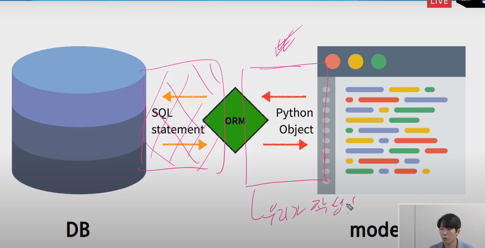
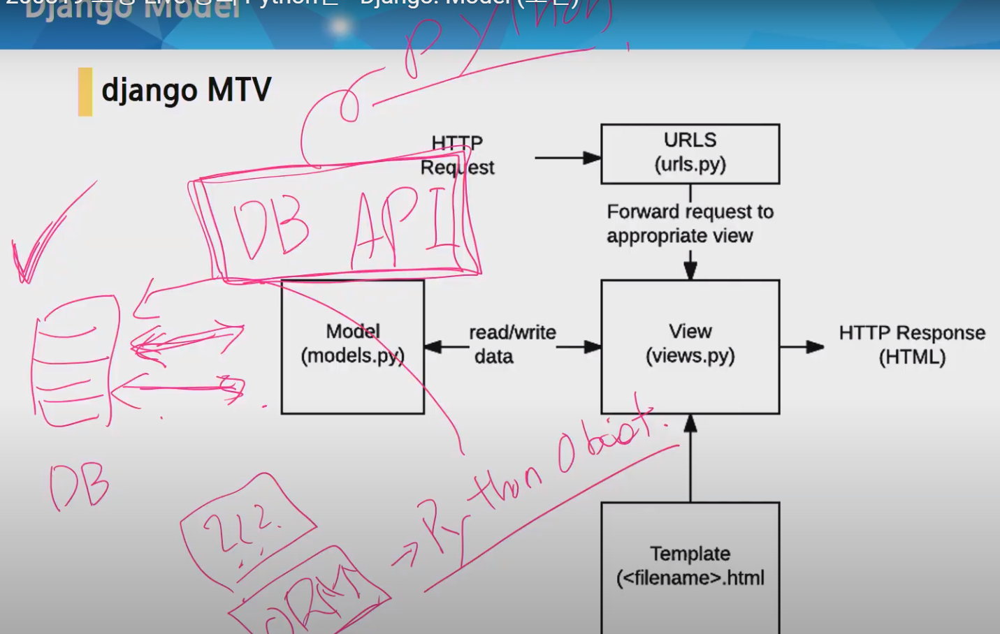

# Django Intro

#### Database의 기본구조

- 각 열에는 고유한 데이터 형식이 지정된다(integer, text, null)
- 행(row), 레코드 다양한 형식의 데이터가 지정된다.
- PK(기본키) 각 행의 고유값으로 Primary Key라고 불린다, 반드시 설정되어야 하며, 데이터베이스 관리 및 관계 설정시 주요하게 활용(각 행의 첫번째 열, 마치 아이디와 같다.)

### ORM

Object - Relational - Mapping은 객체 지향 프로그래밍 언어를 사용하여 호환되지 않는 유형의 시스템간에(Django-SQL) 데이터를 변환하는 프로그래밍 기술이다. 이것은 프로그래밍 언어에서 사용할 수 있는 '가상 객체 데이터베이스'를 만들어 사용한다.

##### ORM의 장점과 단점

- 장점

  - SQL을 잘 알지 못해도 DB조작이 가능

  - SQL의 절차적 접근이 아닌 객체 지향적인 접근으로 인한 높은 생산성

- 단점

  - ORM만으로 완전한 서비스를 구현하기 어려운 경우가 있음

- 현대 웹 프레임워크의 요점은 웹 개발의 속도를 높이는 것. (생산성)

##### 우리는 DB를 객체로 조작하기 위해 ORM을 사용한다.

# 실습

### app생성

$ python manage.py startapp articles

setting에 INSTALLED_APPS에 앱 등록한다

앱 등록 순서는 

1 우리가 만든앱

2 서드파티앱

3 장고 내장앱 순서로 작성

Django github Django Django db model base.py 에서 내장된거 찾기

#### CharField(max_length=None)

- 길이의 제한이 있는 문자열을 넣을 때 사용
- max_length가 필수인자
- 필드의 최대 길이, 데이터베이스와 django의 유효성검사

- input type text

#### TextField()

- 글자의 수가 많을 때 사용

#### DateTimeField()

- 최초 생성 일자: `auto_now_add = True`
  - django ORM이 최초 데이터 입력시에만 현재 날짜와 시간으로 갱신
  - 테이블에 어떤 데이터를 최초로 넣을 때
- 최종 수정 일자: `auto_now=True`
  - django ORM이 save를 할 때마다 현재 날짜와 시간으로 갱신

---

### Migrations

- django가 model에 생긴 변화를 반영하는 방법(git에서 commit 쌓는거랑 비슷한 느낌)

- 마이그레이션 실행 및 DB 스키마를 다루기 위한 몇가지 명령어

---

##### makemigrations

- model을 변경한 것에 기반한 새로운 마이그레이션을 만들 때 사용
- 모델을 변경한 것에 기반한 새로운 마이그레이션을 만들 때 사용
- 모델을 활성화 하기 전에 DB 설계도를 작성
- 생성된 마이그레이션 파일은 데이터 베이스 스키마를 위한 버전관리 시스템이라고 생각

##### migrate

- 마이그레이션을 DB에 반영하기 위해 사용
- 작성된 마이그레이션 파일들을 기반으로 실제 DB에 반영
- db.splite3라는 데이터베이스 파일에 테이블을 생성
- 모델에서의 변경 사항들과 DB의 스키마가 동기화를 이룸

##### sqlmigrate

- 마이그레이션에 대한 SQL구문을 보기 위해 사용
- 해당 마이그레이션 파일이 SQL문으로 어떻게 해석되어서 작성되는지 확인하기 위해 사용.

##### showmigrations

- 프로젝트 전체의 마이그레이션과 각가의 상태를 확인하기 위해 사용.

#### Model 의 중요 3단계

1. model.py : 변경사항 발생
2. makemigrations : migrate 파일 생성
3. migrate : DB적용

