# Django Intro

## Preview

1. startproject
2. startapp
3. app등록 - settings.py
4. url www.xxx.com
5. view - 동작
6. template

### 1. Django 설치

##### 1-1. 첫 설치 때만 하는 파일

- vscode에서 Django 설치
- bit bash 창에서 pip install Django 로 설치하기
  - cd : change directory
  - ls : 현재위치의 파일표시
  - pip list : pip로 설치한 것들 버전 표시

- json파일 세팅하기(vscode Django설치 페이지 밑에 복붙가능)

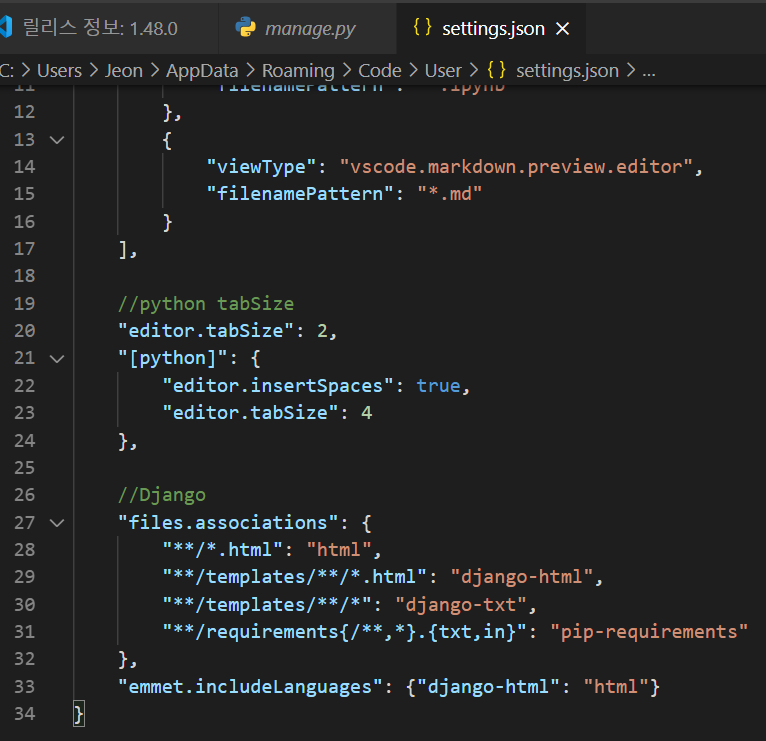

##### 1-2. 프로젝트 만들때마다 하는 것

- 파일트리 만들기

  - 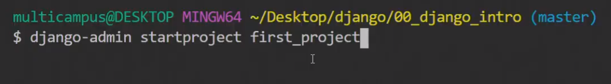

  - 위와 같이 코드 입력해서 파일트리 만들기

    

- git bash 창에서 python mange.py runserver 입력하고 아래쪽에 starting development sercer at http://127.0.0.1:8000/ 사이트 생성된것 확인하고 누르기

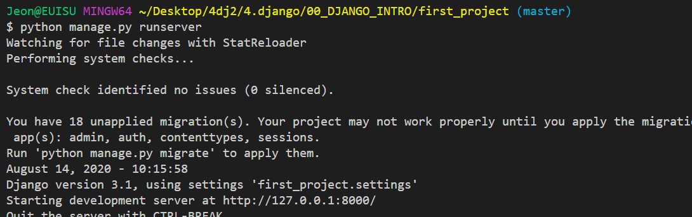

- 페이지에서 아래가 화면이 보이는지 확인하기! (이제부터 시작이닷)

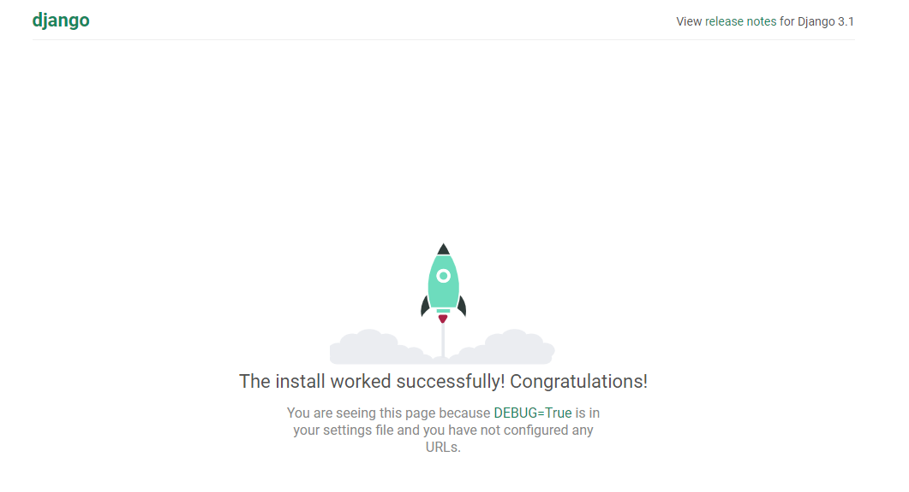

### 2. 프로젝트 시작 

> 반드시 앱 생성(startapp)하고 앱 등록(setting 설정)을 순서대로 해야한다.

##### 1) 기본생성파일 

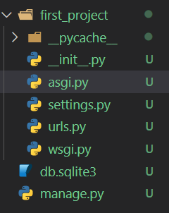

1) `__init__`.py

- 패키지 초기화 할 때마다 등장

2) asgi.py

- 비동기 웹 서버 일단 건드리지말자

2) setting.py

- Django 프로젝트의 모든 셋팅을 관장한다!

2) urls.py

- 요청이 장고서버로 들어왔을때 가장 먼저 만나는 부분이다!

2) wsgi.py

- 일반 웹 서버 마지막 최종발표 때 사용

##### 2) 앱 만들기(앱의 이름은 반드시 복수형으로 만들자)

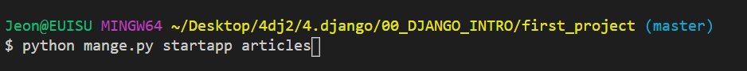

- 이게 생성되네

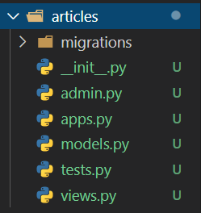

1) `__init__`.py

- 초기화초기화

2)  admin.py

- 관리자 전용 기능

3)  apps.py

- 앱에 대한 정보가 담겨있다

4)  models.py  (MTV 중M)

- 오늘은 안본대..ㅠ

5)  tests.py

- 테스트 코드를 작성하는 것

6)  views.py  (MTV 중V)

- 장고의 디자인 패턴 MTV중 V 담당

##### 3) 시작하자 (순서대로해라 찐짜)

###### 1. setting.py

- first_project/setting.py 의 33 번째 줄에 'articles' 추가
  - 반드시 위쪽부터 추가해라!
  - 컴마도 꼭 붙여줘라! (순수한 파이썬에서는 문법적으로 다르다)

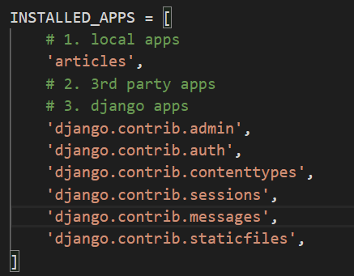

- 한글로 바꾸자(LANGUAGE_CODE = 'ko_kr') 
- TIME_ZONE은 나중에 바꾸자 (서울시간)

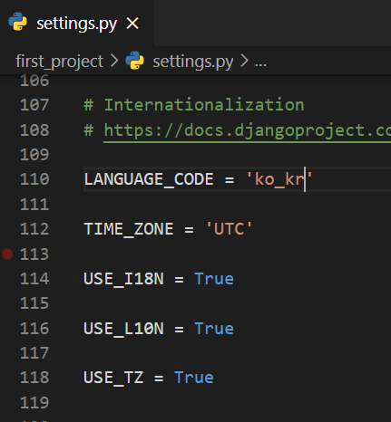

###### 2.urls.py

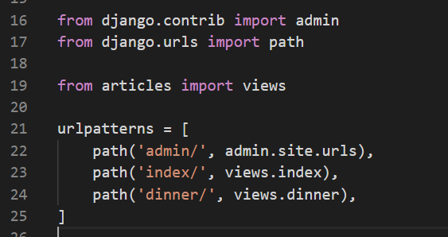

- views.py 에서 함수를 불러온다 `path('index/', views.index),`

  

###### 3. views.py (함수간 2줄 뛰우기)

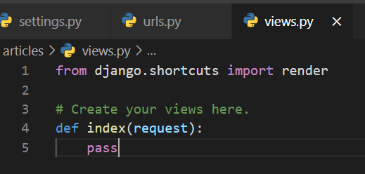

- 함수를 하나 만들자 request 랑 return 필수

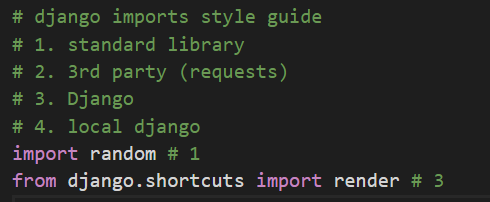

- Django syle guide 순서 지키자

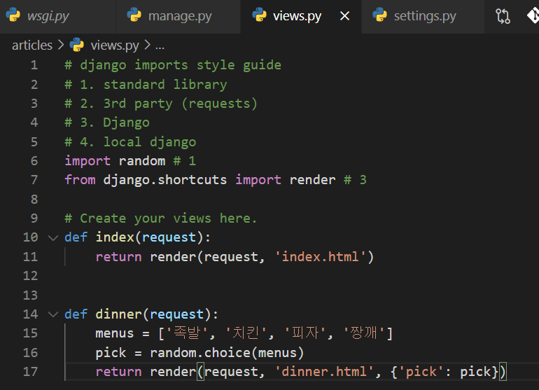

- 렌더를 리턴을 해준다(request, 'html 파일이름')

###### 4. templates

###### 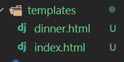

- templates 폴더 안에 index.html 작성 (폴더이름 반드시 맞춰라)

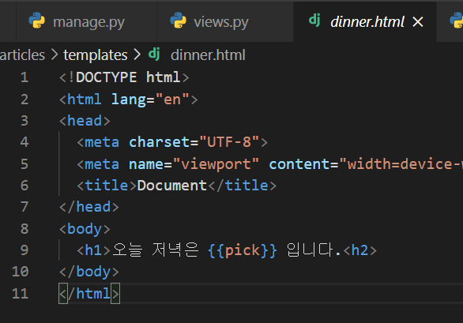

- 새로운 문법 두두등장! {{pick}} view에 작성한 pick 불러왕

###### 5. 홈페이지 들어가보자

>  git bash 창에 `python manage.py runserver` 작성해서 주소 클릭하구 
>
> 홈페이지 창에 /index or /dinner 추가해서 바바 

########################### 오후강의 ##############################

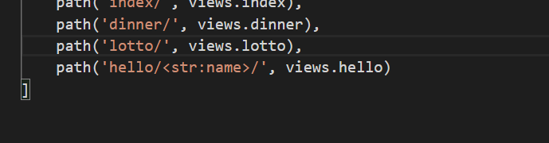

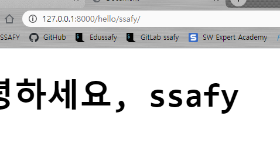

- 이런식으로 활용가능 (잘 봐바라 설명은 생략한다.)

### Django Template Language (DTL)

- django template system에서 사용하는 built-in template ststem이다.
- 조건, 반복, 치환, 필터, 변수 등의 기능을 제공
- 프로그래밍적 로직이 아니라 프레젠테이션을 표현하기 위한 것
- 파이썬처럼 if, for를 사용할 수 있지만 이거는 단순히 python code로 실행되는 것은 아니다.

Syntax

- variable : {{ xxx }}
- filter : {{ variable | filter}}
- tags : 

